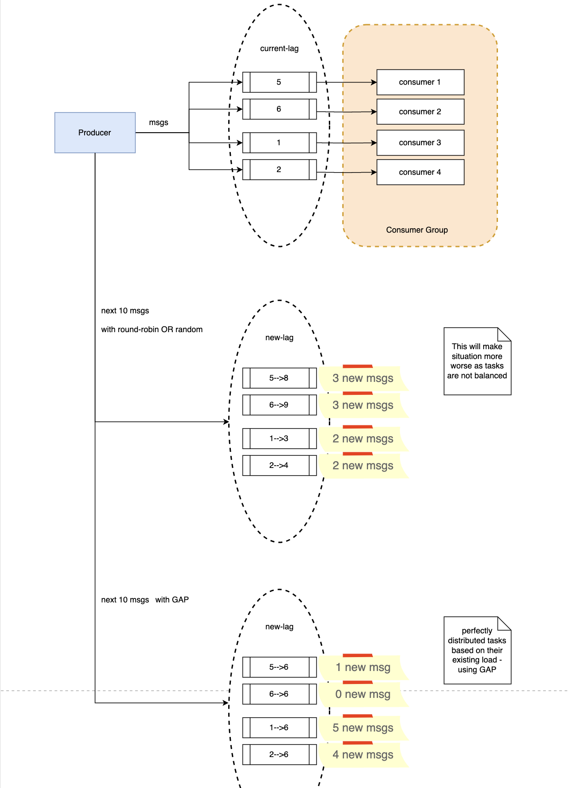

# Kafka producer load balancer 

A custom producer implementation in go, which will keep lag in balance for a consumer group.

Solves a sepecific case where multiple consumers are processing msgs from a topic at their own pace, overtime 
if kafka lag is not balanced among them, its best use case to use.

## Example - 

**First part** of diagram with a topic having 4 partitions and 4 consumers in a consumer group.
Current lag is - 5, 6, 1, 2 

**Second part** - we want to push next batch of 10 tasks and we use default kafka producer 
with random partitioning or round-robin, new lag will be as 
8, 9, 3, 4.   
By this consumers are not balanced, two of them have heavy load and other two are less tasks to do.

**3rd part** - using GAP 
consumer 2 already have enough tasks so 0 tasks there 
consumer 1 - 1 task 
consumer 3 and 4 - have less so add more tasks there 

## 

## Solution - 
load balancing each time we publish msg to kafka.

## GAP - Group Aware Producer (as I call it)

How ? 

 - Monitor -> a kafka admin client which gets lag per partition from kafka when called.
 - Cache -> keeps lag per partition in memory, refresh using monitor after TTL in a separate go-routine call. Sort the lag in increasing order.
 - Producer -> for a batch of msgs, calls cache to get min lag partition for all the msgs and sends batch to kafka.

